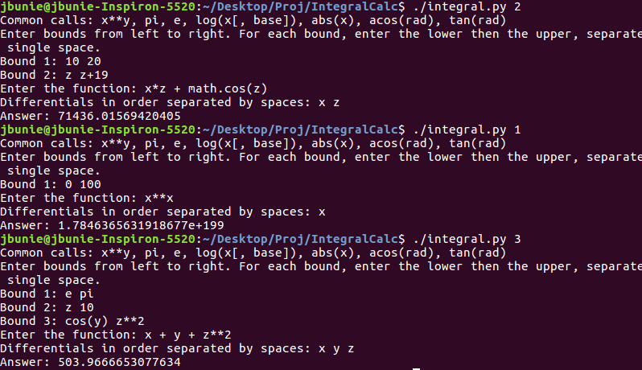

# Multivariable Integral Calculator

### About
 - Small command line program I made to help me with my multivariable math homework. 
 - It is significantly faster than wolfram alpha, but does not display the integration steps like wolfram  does.
 - I might one day create a graphical interface for this program. Probably not.

### Running Application on Linux
 - Download integral.py 
 - Install Scipy: sudo pip3 install scipy 
 - Install matplitlib: sudo pip3 install matplotlib
 - Run program with ./integral.py 
 
 
